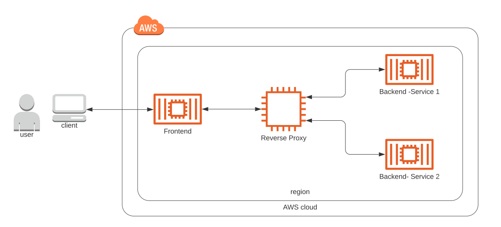

# Udagram Microservices

Udagram is a simple cloud application developed alongside the Udacity Cloud Engineering Nanodegree. It allows users to register and log into a web client, post photos to the feed, and process photos using an image filtering microservice.

The goals of this project:
 - Refactor monolith application to microservice.
 - Build CI pipeline for each microservice using Docker and Travic CI
 - Build CD pipeline for each microservice using AWS EKS.

Monolith vs Microservice architecture of the app:
- The monolith app consists of two parts:
  1. Frontend - Angular web application built with Ionic Framework
  2. Backend RESTful API - Node-Express application

- After refactoring to microservices, the app consists of four parts:
  1. Frontend service - Angular web application built with Ionic Framework
  2. Udagram feed api - node-express API for feed functionality of the app 
  3. Udagram user api - node-express API for user functionality of the app 
  2. Reverse proxy - to forward requests to appropriate service either feed service or user service
  

## Tech Stack
 - Nodejs
 - Docker
 - Travis CI
 - Kubernets
 - AWS EKS
 - AWS S3
 - AWS RDS

## CI/CD Infrastructure
### DockerHub Repositories
The DockerHub repositories of the microservices can be found in the following link:
- https://hub.docker.com/repository/docker/mahmoudsharshar/udagram-reverseproxy
- https://hub.docker.com/repository/docker/mahmoudsharshar/udagram-frontend
- https://hub.docker.com/repository/docker/mahmoudsharshar/udagram-api-user
- https://hub.docker.com/repository/docker/mahmoudsharshar/udagram-api-feed

### Travis CI Build
we used travis CI to track changes on github repo then build new images and push them to docker hub repositories.
The configuration of Travis CI can be found in .travis.yaml file

### Conitnuous Integration
`kubectl get nodes`

`kubectl get pods`

`kubectl describe services`

`kubectl describe hpa`

`kubectl logs <your pod name>`
- Feed service logs

- User service logs

- Reverse proxy service logs

- Frontend service logs

## Resources
- [Best practices for writing Dockerfiles](https://docs.docker.com/develop/develop-images/dockerfile_best-practices/)
- [kubectl Cheat Sheet](https://kubernetes.io/docs/reference/kubectl/cheatsheet/)
- [Creating an Amazon EKS cluster](https://docs.aws.amazon.com/eks/latest/userguide/create-cluster.html)
- [Create a Kubernetes cluster in Amazon EKS using a Reverse Proxy.](https://blog.juadel.com/2020/05/15/create-a-kubernetes-cluster-in-amazon-eks-using-a-reverse-proxy/)
- [set up Kubernetes Metrics Server and Horizontal Pod Autoscaler on Amazon EKS](https://aws.amazon.com/premiumsupport/knowledge-center/eks-metrics-server-pod-autoscaler/?nc1=h_ls)
- [Installing the Kubernetes Metrics Server](https://docs.aws.amazon.com/eks/latest/userguide/metrics-server.html)